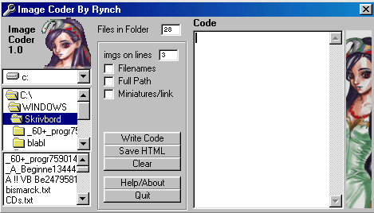



## Image HTML Coder

### Description

The program writes the HTML code for all images in a folder. with features as miniatures, how many images there shall be on each line. and alot more.
 
### More Info
 

             |
---                |---
**Submitted On**   |2002-12-21 22:10:58
**By**             |[Anders Larsson](https://github.com/Planet-Source-Code/PSCIndex/blob/master/ByAuthor/anders-larsson.md)
**Level**          |Beginner
**User Rating**    |4.3 (13 globes from 3 users)
**Compatibility**  |VB 6\.0
**Category**       |[Complete Applications](https://github.com/Planet-Source-Code/PSCIndex/blob/master/ByCategory/complete-applications__1-27.md)
**World**          |[Visual Basic](https://github.com/Planet-Source-Code/PSCIndex/blob/master/ByWorld/visual-basic.md)
**Archive File**   |[Image\_HTML15175412232002\.zip](https://github.com/Planet-Source-Code/anders-larsson-image-html-coder__1-41811/archive/master.zip)

